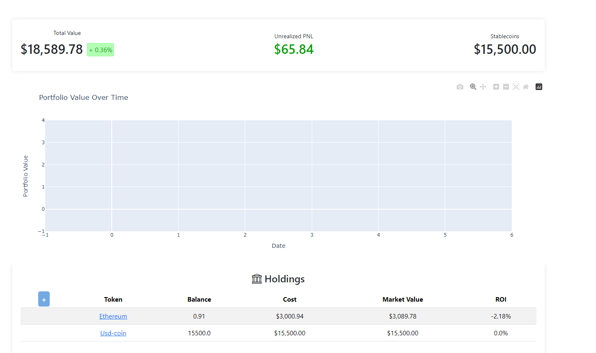

# A simple crypto dashboard to check your current holdings and profits

With this responsive dashboard, you can monitor your crypto holdings and profits in real-time. It is built using Flask and the CoinGecko API.




_Disclaimer: This project is not finished, and I may not continue its development. Everything is working but many features are still missing. Feel free to contribute to this project and / or adapt it to your needs._

## Features

- Add your crypto holdings and see your total investment, current value, and profit/loss.
- Check your portfolio's performance over time.


## Important

For the chart to be updated, you need to launch `update_pf_value.py` in the background. This script updates the portfolio value every 24 hours. You can change this interval in the script.


## Installation

1. Clone the repository:

```bash
git clone https://github.com/Rayanworkout/portfolio-dashboard
```

2. Install the required packages:

```bash
pip install -r requirements.txt
```

3. Run the app:

Option 1: with the launch script:

```bash
chmod +x launch.sh
./launch.sh
# or under windows
./launch.bat
```

Option 2: manually:

```bash
export FLASK_APP=app.py
flask run
```
```bash
python update_pf_value.py
```
